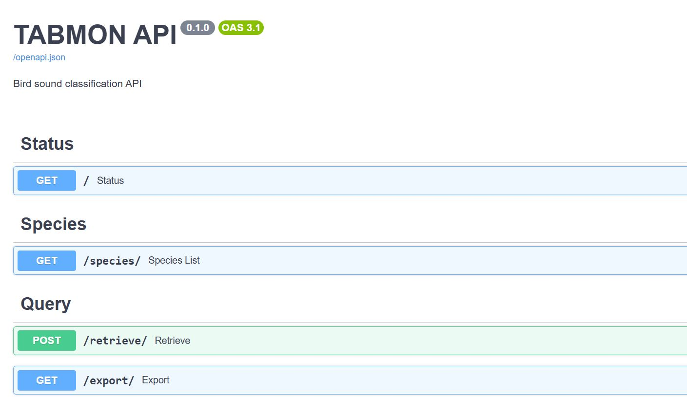
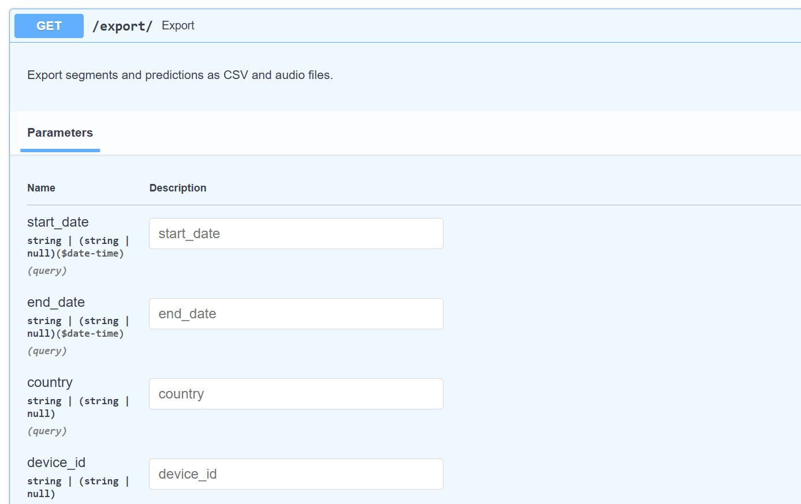

# TABMON Classification Pipeline
This is a data and classification pipeline repository for the [TABMON](https://tabmon-eu.nina.no/) (Transnational Acoustic Biodiversity Monitoring Network). The purpose of this repository is to provide an end-to-end framework from raw field data to model species predictions.

Authors: Ben McEwen, Corentin Bernard, Benjamin Cretois \
**Adapted from the AvesEcho pipeline (Ghani et al. 2024) - [paper](https://arxiv.org/abs/2409.15383)*

### Getting Started 🌱
*Set up with:*

```
uv sync
```

Then select the `tabmon` env.

Alternatively, create conda or virtualenv environment and specify python version 3.11.10 i.e. `conda create --name tabmon python=3.11.10`. Install dependencies `pip install -r requirements.txt`

*To Run Inference:*\
**Note that you must specify module `python -m` and run from the base directory as shown.*

Place audio into `audio/` directory and specify directory to analyze `--i` relative to `analyze.py` i.e. `audio/<data>/`.
After installing dependencies run:
```
python -m pipeline.analyze --i audio/<data> --model_name birdnet --device_id <id> --deployment_id <id>
```
Both 'birdnet', 'fc' and 'passt' models are setup.

#### Demo Data
A small demo dataset is provided. The pipeline can be run using `python -m pipeline.analyze --i audio/demo`.

### Database Setup
The pipeline can also be run using a FastAPI server which stores predictions in an SQL database.

To *start the server* run:
```
fastapi dev app/main.py
```
The database can be queried using the FastAPI /docs at http://localhost:8000/docs.



Demo data is available by default to test the API functionality. Model predictions can be queried using the export endpoint (shown below).




---